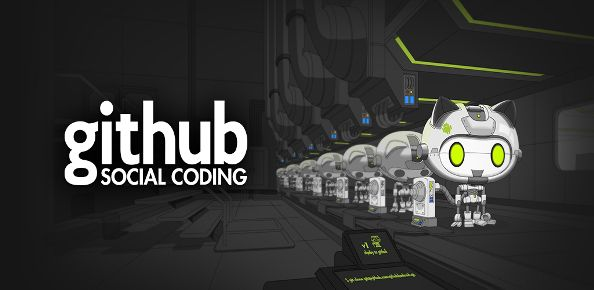

# Hello World

[Project 2](https://uo-cit.github.io/p2-17S-lewisisz/) is to set up a project page
[Project 3](https://uo-cit.github.io/p3-17s-lewisisz/) is to set up a web app to get images from 500px and flickr.
[Project 4](https://uo-cit.github.io/p4-17s-lewisisz/) is to set up a web app to get images from Unsplash, and to get videos from Youtube.
